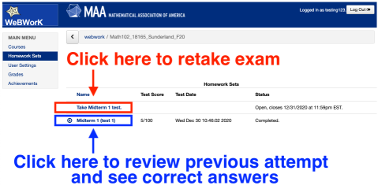
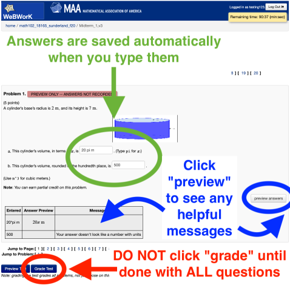
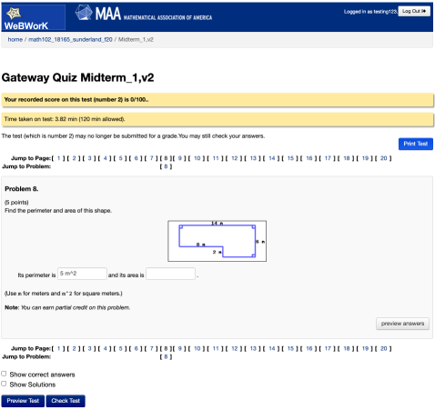

# Introduction to Statistics
City University of New York - College of Staten Island - 2021 Spring  
Math 113/21204 MW 2:30-4:25  
Dr Matthew Han-Jing Sunderland  

Office hours MW 5:00-6:30 on Blackboard Collaborate

# Day 1 Checklist
1. Confirm your preferred email on CunyFirst > Self Service > Personal Info
1. Confirm you can log into Blackboard > This course > Blackboard Collaborate
1. Create free [Gradescope.com](https://www.gradescope.com) account and add course 5V74JJ  
   (This is where you will submit exams and labs.)
1. Create free [Perusall.com](https://www.perusall.com) account and add course SUNDERLAND-A8N72  
   You will see the following
   1. *Introductory Statistics, OpenStax*
   1. *Standard Normal Chart*
1. Log into WeBWorK [math.csi.cuny.edu/webwork2/](https://www.math.csi.cuny.edu/webwork2/Math113_21204_Sunderland_S21/) and change your password  

# Weekly Requirements
1. **Synchronous Lecture** Monday & Wednesday on Blackboard Collaborate &emsp; —*starting 2.1*
1. **Reading annotations** due Sunday on Perusall &emsp; —*starting 2.7*
1. **Problemset** due Sunday on WeBWorK &emsp; —*starting 2.14*
1. **Lab** due Sunday on Gradescope &emsp; —*starting 2.14*

# Grade
Your grade is the average of **Exam 1**, **Exam 2**, **Exam 3**, **Final**, and **Coursework**.  
Coursework consists of lecture participation (just be there and engaged) and reading annotations, problemsets, and labs.

# Important Dates
1. Add deadline = 2.4
1. Drop deadline = 2.18
1. Withdraw deadline = 5.17

<!-- # Helpful Links and Resources -->

# Labs
| Link | Lab demo | Lab due | Topic |
| - | ---- | ---- | - |
| [Lab 1](https://mybinder.org/v2/gh/mattsunderland/csi21S/HEAD?filepath=113%2Flabs%2Flab1.ipynb) | 2.3  | 2.14 | How to submit labs |
| [Lab 2](https://mybinder.org/v2/gh/mattsunderland/csi21S/HEAD?filepath=113%2Flabs%2Flab2.ipynb) | 2.10 | 2.21 |
| Lab 3 | 3.3  | 3.14 |
| Lab 4 | 3.17 | 4.4  |
| Lab 5 | 4.7  | 4.18 |
| Lab 6 | 4.14 | 4.25 |
| Lab 7 | 4.21 | 5.2  |
| Lab 8 | 4.28 | 5.9  |
| Lab 9 | 5.5  | 5.16 |

# Schedule
| | Reading due | Lecture date | WeBWorK due | Topic |
| --- | ---- | ---- | ---- | - |
| A,B |      | 2.1  | 2.21 | [Population and Sample. Data type.](../notes/notes2ab.pdf) |
| C   |      | 2.3  | 2.21 | [Frequency table.](../notes/notes2bc.pdf) **Lab 1.** |
| D,E | 2.7  | 2.8  | 2.21 | [Histogram. Mean.](../notes/notes2de.pdf) |
| E,F | 2.7  | 2.10 | 2.21 | Grouped mean. Standard deviation. **Lab 2.** |
| G,H | 2.14 | 2.17 | 2.28 | Boxplot. Correlation. |
| I   | 2.21 | 2.22 | 3.7  | Regression. **Review.** |
|     |      | 2.24 |      | **Exam 1** |
| J,K | 2.28 | 3.1  | 3.14 | Probability. Add rule and multiply rule |
| L   | 2.28 | 3.3  | 3.14 | Complement and conditional probability **Lab 3** |
| M,N | 3.7  | 3.8  | 3.21 | Counting principle. Probability distributions |
| O,P | 3.7  | 3.10 | 3.21 | Binomials. Standard normal. |
| Q,R | 3.14 | 3.15 | 4.4  | Normals. Sampling distributions. |
| S   | 3.14 | 3.17 | 4.4  | CLT. **Lab 4.** |
|     |      | 3.22 |      | **Review** |
|     |      | 3.24 |      | **Exam 2** |
| T,U | 4.4  | 4.5  | 4.18 | Estimate p. Estimate µ. |
|     | 4.4  | 4.7  | 4.18 | **Lab 5.** |
| V,W | 4.11 | 4.12 | 4.25 | Testing p. Testing µ |
|     | 4.11 | 4.14 | 4.25 | **Lab 6.** |
| X   | 4.18 | 4.19 | 5.2  | Testing p₁ p₂ |
|     | 4.18 | 4.21 | 5.2  | **Lab 7.** |
| Y,Z | 4.25 | 4.26 | 5.9  | Testing µ₁ µ₂ for independent samples. Testing µ₁ µ₂ for matched pairs. |
|     | 4.25 | 4.28 | 5.9  | **Lab 8.** |
|AA,AB|      | 5.3  | 5.16 | Goodness of fit. Contingency tables |
|     |      | 5.5  | 5.16 | **Lab 9.** |
|     |      | 5.10 |      | **Review** |
|     |      | 5.12 |      | **Exam 3** |
|     |      | 5.17 |      | **Review** |
|     |      | TBD  |      | **Final**  |

<!--
# Reading and Lecture Schedule
By each Sunday below

1. Go to [Perusall.com](https://www.perusall.com) and **do the reading**. Make the minimum number of annotations:
    1. Highlight interesting passages and type in comments and questions
    1. Click on classmates' highlights and add to the discussion
    1. Click on the instructor's highlights (if any) and add to the discussion.
1. **Watch the recordings** linked below
1. **Review the notes** linked below

`A`. (2.7) [Recording 1] [2] [3] [Notes 1] [2] [3]  
`B`. (2.7)  
`C`. (2.14)  
`D`. (2.14)  
`E`. (2.21)  
`F`. (2.21)  
`G`. (2.28)  
`H`. (2.28)  
`A-G`. (2.28) Midterm 1  
`I`. (3.7)  
`J`. (3.7)  
`K`. (3.14)  
`L`. (3.14)  
`M`. (3.21)  
`N`. (3.21)  
`H-N`. (3.28) Midterm 2  
`O`. (4.7)  
`P`. (4.7)  
`Q`. (4.11)  
`R`. (4.11)  
`S`. (4.18)  
`T`. (4.18)  
`U`. (4.25)  
`V`. (4.25)  
`W`. (5.2)  
`X`. (5.2)  
`Y`. (5.9)  
`Z`. (5.9)  
`A-Z`. (TBD) Final  

# Lab and Problem Set Schedule
By each Sunday below

1. Go to [WeBWorK](https://www.math.csi.cuny.edu/webwork2/) and **do the problemset**
1. **Do the lab** linked below
    * If it is a Jupyter notebook:
        1. Wait for the notebook to load (server can take up to 5 minutes to spin up)
        1. Complete the lab
        1. Save your completed lab as a PDF and submit to *Gradescope*. Directions included at end of each jupyter lab
    * If the lab is a PDF worksheet:
        1. Download the worksheet to your computer
        1. Open it in a program that lets you mark it up (eg, macOS Preview, Notability, etc)
        1. Complete the worksheet
        1. Save your completed lab as a PDF and submit to *Gradescope*

`AB`. (2.14) https://mybinder.org/v2/gh/anniebmcc/pycalclab/master?filepath=mat301a.ipynb  
`CD`. (2.21)  
`EF`. (2.28)  
`GH`. (3.7)  
`IJ`. (3.14)  
`KL`. (3.21)  
`MN`. (3.28)  
`OP`. (4.11)  
`QR`. (4.18)  
`ST`. (4.25)  
`UV`. (5.2)  
`WX`. (5.9)  
`YZ`. (5.16)  

# Webwork Exam Tips

1. Go to "Homework Sets" and **click "Take Midterm 1 test" to take or retake Midterm 1**.
1. Click "Midterm 1 (test 1)" to review previous attempt 1, click "Midterm 1 (test 2)" to review previous attempt 2, etc.

3. Answers are saved automatically when you type them. After you have typed in your answer to one problem, just click on the next problem you want to do.
1. Click "preview" to see messages, if any, about the format of your answer.
1. **DO NOT click "grade" until done with ALL questions.**

6. A yellow banner means this attempt is already submitted: no changes are possible. You may review your recorded answers and the correct answers for this attempt. To retake the exam, go back to the "Homework sets" page.

-->
