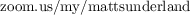

# Introduction to Statistics

# Day 1 Checklist
1. Confirm your email address(s): [emails.txt](./emails.txt). If incorrect, submit correction here: [googleform]
1. Download zoom and create free account
1. Create free [perusall.com](https://www.perusall.com) account and add course ######
1. Create free [gradescope.com](https://www.gradescope.com) account and add course ######

# Weekly Requirements
1. Reading comments _due Sunday_ [(perusall.com)](https://www.perusall.com)
1. Lectures _due Sunday_
1. Problemset _due Sunday_ [(math.csi.cuny.edu/webwork2/)](https://www.math.csi.cuny.edu/webwork2/)
1. Lab _due Sunday_ (links below; submit on [gradescope.com](https://www.gradescope.com))
1. Checkin _signup due Sunday_ (signup emailed weekly)  

# Grade
`Coursework = AVG(Reading, Problemset, Lab, Checkin)`  
`Grade = AVG(Coursework, Exam 1, Exam 2, Final)`

# Important Dates
1. Add deadline = 2.4
1. Drop deadline = 2.18
1. Withdraw deadline = 5.17

# Lectures
A. (2.7) [Recording 1] [2] [3] [Notes 1] [2] [3]  
B. (2.7)  
C. (2.14)  
D. (2.14)  
E. (2.21)  
F. (2.21)  
G. (2.28)  
H. (2.28)  
I. (3.7)  
J. (3.7)  
K. (3.14)  
L. (3.14)  
M. (3.21)  
N. (3.21)  
O. (4.11)  
P. (4.11)  
Q. (4.18)  
R. (4.18)  
S. (4.25)  
T. (4.25)  
U. (5.2)  
V. (5.2)  
W. (5.9)  
X. (5.9)  
Y. (5.16)  
Z. (5.16)  

# Labs
AB. (2.7) https://mybinder.org/v2/gh/anniebmcc/pycalclab/master?filepath=mat301a.ipynb  
CD. (2.14)  
EF. (2.21)  
GH. (2.28)  
IJ. (3.7)  
KL. (3.14)  
MN. (3.21)  
OP. (4.11)  
QR. (4.18)  
ST. (4.25)  
UV. (5.2)  
WX. (5.9)  
YZ. (5.16)  
