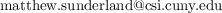

# Fundamentals of Mathematics II
City University of New York - College of Staten Island - 2021 Spring  
SLS 218/21451 MW 12:20-2:15  
Dr Matthew Han-Jing Sunderland  

# Day 1 Checklist
1. Confirm your email addresses here: [emails.png](./emails.png).  
   Submit corrections here: [googleform]
1. Download zoom and create free account
1. Create free [Perusall.com](https://www.perusall.com) account and add course ######
1. Create free [Gradescope.com](https://www.gradescope.com) account and add course ######
1. Log into WeBWorK [math.csi.cuny.edu/webwork2/](https://www.math.csi.cuny.edu/webwork2/Math218_21451_Sunderland_S21/) and change your password