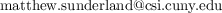

# Calculus III
City University of New York - College of Staten Island - 2021 Spring  
Math 233/21243 MW 6:30-8:10  
Dr Matthew Han-Jing Sunderland  

# Day 1 Checklist
1. Create free [Perusall.com](https://www.perusall.com) account and add course SUNDERLAND-DBALK  
1. Create free [Gradescope.com](https://www.gradescope.com) account and add course 74G8DX  

# Schedule
\*HW means any WeBWorK problem sets and/or Labs corresponding to the topic

| | Reading due | Lecture date | HW\* due | Topic |
| --- | ---- | ---- | ---- | - |
| A   |      | 2.1  | 2.14 | Vectors in the plane. Vectors in 3-space. |
| B   |      | 2.3  | 2.14 | Dot product. Cross product. |
| C   | 2.7  | 2.8  | 2.21 | Planes in 3-space. |
| D   | 2.7  | 2.10 | 2.21 | Quadratic surfaces. **Lab 1.** |
| E   | 2.14 | 2.17 | 2.28 | Vector-valued functions. Calculus of vector-valued functions. |
| F   | 2.21 | 2.22 | 3.7  | Arclength and speed. **Lab 2.** |
| G   | 2.21 | 2.24 | 3.7  | Functions of several variable. Limits and continuity in several variables. |
| H   | 2.28 | 3.1  | 3.14 | Partial derivatives |
| I   | 2.28 | 3.3  | 3.14 | Differentiability and tangent planes. **Lab 3.** |
| J   | 3.7  | 3.8  | 3.21 | Gradient and directional derivatives. **Review.** |
|     |      | 3.10 |      | **Exam 1** |
| K   | 3.9  | 3.15 | 4.4  | Chain rule in several variables. |
| L   | 3.14 | 3.17 | 4.4  | Optimization in several variables. |
| M   | 3.21 | 3.22 | 4.11 | Langrange multipliers. |
| N   | 3.21 | 3.24 | 4.11 | Integration in several variables. |
| O   | 4.4  | 4.5  | 4.18 | Double integrals over general regions |
| P   | 4.4  | 4.7  | 4.18 | Triple integrals. **Lab 4.** |
| Q   | 4.11 | 4.12 | 4.25 | Integration in polar and cylindrical coordinates |
| R   | 4.11 | 4.14 | 4.25 | Integration in spherical coordinates
| S,T | 4.18 | 4.19 | 5.2  | Vector fields. Line integrals |
| U   | 4.18 | 4.21 | 5.2  | Conservative vector fields. **Review.** |
|     |      | 4.26 |      | **Exam 2** |
| V   | 4.25 | 4.28 | 5.9  | Parametrized surfaces. Surface integrals and surface area. |
| W   | 5.2  | 5.3  | 5.16 | Surface integrals of vector fields |
| X   | 5.2  | 5.5  | 5.16 | Green's Theorem |
| Y   | 5.9  | 5.10 | 5.23 | Stokes' Theorem |
| Z   | 5.9  | 5.12 | 5.23 | Divergence theorem |
|     |      | 5.17 |      | **Review** |
|     |      | TBD  |      | **Final**  |

