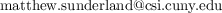

# Calculus III
City University of New York - College of Staten Island - 2021 Spring  
Math 233/21243 MW 6:30-8:10  
Dr Matthew Han-Jing Sunderland  

  
_When emailing, put "233" in the subject_

~~Office hours MW 5:00-6:30 on Blackboard Collaborate~~  
Office hours after class (MW) on Blackboard Collaborate

# Day 1 Checklist
1. Confirm your preferred email on CunyFirst > Self Service > Personal Info
1. Confirm you can log into Blackboard > This course > Blackboard Collaborate
1. Create free [Gradescope.com](https://www.gradescope.com) account and add course 74G8DX  
   (This is where you will submit exams and labs.)  
1. Create free [Perusall.com](https://www.perusall.com) account and add course SUNDERLAND-DBALK  
   You will see the following
   1. *Calculus Volume 3, OpenStax*
1. Log into WeBWorK [math.csi.cuny.edu/webwork2/](https://www.math.csi.cuny.edu/webwork2/Math233_21243_Sunderland_S21/) and change your password  

# Weekly Requirements
1. **Synchronous Lecture** Monday & Wednesday on Blackboard Collaborate &emsp; —*starting 2.1*
1. **Reading annotations** due Sunday (11:59 PM) on Perusall &emsp; —*starting 2.7*
1. **Problemset** due Sunday (11:59 PM) on WeBWorK &emsp; —*starting 2.14*
1. **Lab** due Sunday (11:59 PM) on Gradescope &emsp; —*starting 2.21*

# Grade
Your grade is the average of **Exam 1**, **Exam 2**, **Final**, and **Coursework**.  
Coursework consists of lecture participation (just be there and engaged) and reading annotations, problemsets, and labs.

# Important Dates
1. Add deadline = 2.4
1. Drop deadline = 2.18
1. Withdraw deadline = 5.17

# Helpful Links and Resources
1. Lecture notes are posted below under [Schedule](#schedule) below after each lecture
1. Blackboard Collaborate automatically processes and posts a recording of each lecture about 30 minutes after the last person has left, available at BlackBoard > Collaborate > ☰ > Recordings
1. CSI Office of Academic Support offers free online tutoring seven days a week. See schedule at https://www.csi.cuny.edu/students/academic-assistance/tutoring

# Labs
| | Lab demo | Lab due | Topic |
| --- | ---- | ---- | - |
[Lab 1](https://mybinder.org/v2/gh/mattsunderland/csi21S/HEAD?filepath=233%2Flabs%2Flab1.ipynb) | 2.17 | 2.28 | How to submit labs
[Lab 2](https://mybinder.org/v2/gh/mattsunderland/csi21S/HEAD?filepath=233%2Flabs%2Flab2.ipynb) | 3.1  | 3.14 | Surfaces
Lab 3 | 3.22 | 4.11
Lab 4 | 3.24 | 4.11
Lab 5 | 4.14 | 4.25

# Schedule
| | Reading due | Lecture date | WeBWorK due | Topic |
| --- | ---- | ---- | ---- | - |
| A   |      | 2.1  | 2.28 | [(1.3) Polar coordinates. (2.1) Vectors in the plane.](../notes/notes3a.pdf) |
| B   |      | 2.3  | 2.28 | [(2.2) Vectors in 3-space. (2.3) Dot product.](../notes/notes3b.pdf) |
| C   | 2.7  | 2.8  | 3.7  | [(2.4) Determinant.](../notes/notes3bc.pdf) |
| D   | 2.7  | 2.10 | 3.7  | [(2.4) Cross product.](../notes/notes3cd.pdf) |
|     |      | 2.17 | 2.28 | **Lab 1.**   |
|     |      | ~~2.22~~ |  |
| D,E | 2.14 | 2.24 | 3.7  | [(2.4) Cross product. (2.5) Lines in space.](../notes/notes3de.pdf) |
| E   | 2.14 | 3.1  | 3.14 | [(2.5) Lines in space. (2.5) Planes.](../notes/notes3e.pdf) |
|     |      | 3.3  | 3.14 | **Lab 2.**
|     |     |~~3.8~~
|E',F,G,G'|3.2|3.10 | 3.21 | [(2.6) Quadrics (3.1) Curves. (3.2) Curve calculus (3.3) Arclen (3.4) Speed](../notes/notes3e'fg.pdf)
|     |      |      |      | **Exam 1** Opens 3.15 Due 4.4
| G'H | 3.14 |      | 4.4  | (4.1) Multivariate f (4.3) Partials
|G',I,J|3.14 | 3.15 | 4.4  | (4.2) Limit, continuity (4.4) Differentiability, tangent plane (4.6) Gradient and directional derivatives
| K,L | 3.14 | 3.17 | 4.4  | (4.5) Chain rule (4.7) Optimization
| M   | 3.21 | 3.22 | 4.11 | (4.8) Langrange multipliers **Lab 3**
| N   | 3.21 | 3.24 | 4.11 | (5.1) Double integral **Lab 4.**
| O   | 4.4  | 4.5  | 4.18 | (5.2) General double integral
| P   | 4.4  | 4.7  | 4.18 | (5.4) Triple integral
| Q   | 4.11 | 4.12 | 4.25 | (5.3) Polar. (2.7, 5.5) Cylindrical.
| R   | 4.11 | 4.14 | 4.25 | (2.7, 5.5) Spherical. **Lab 5.**
| S,T | 4.18 | 4.19 | 5.2  | (6.1) Vector fields. (6.2) [Line integrals](https://scribbletogether.com/whiteboard/2DB06D4A-7B31-4CFF-8427-35B6821BEF16)
| U   | 4.18 | 4.21 | 5.2  | (6.3) Conservative vector fields. **Review.**
|     |      | 4.26 |      | **Exam 2**
| V   | 4.25 | 4.28 | 5.9  | (6.6) Surface parametrization, integral, area
| W   | 5.2  | 5.3  | 5.16 | (6.6) Surface integral of vector field. (6.5) Divergence and curl. |
| X   | 5.2  | 5.5  | 5.16 | (6.4) Green's Theorem
| Y   | 5.9  | 5.10 | 5.23 | (6.7) Stokes' Theorem
| Z   | 5.9  | 5.12 | 5.23 | (6.8) Divergence theorem
|     |      | 5.17 |      | **Review**
|     |      | TBD  |      | **Final**

